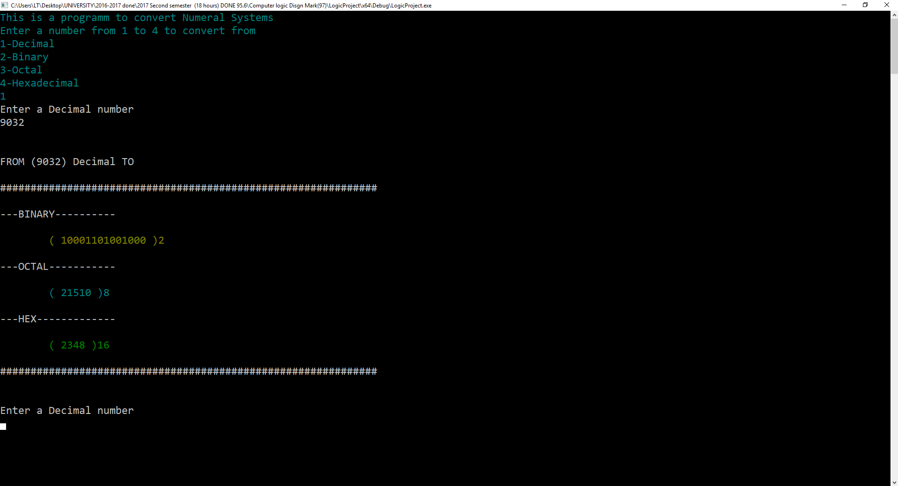
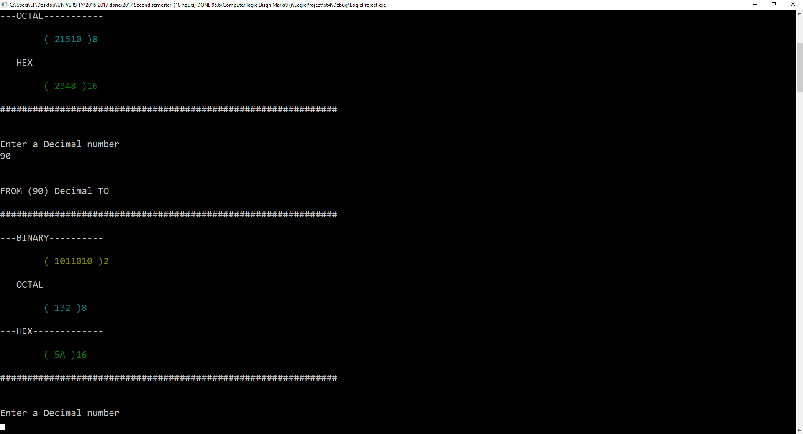
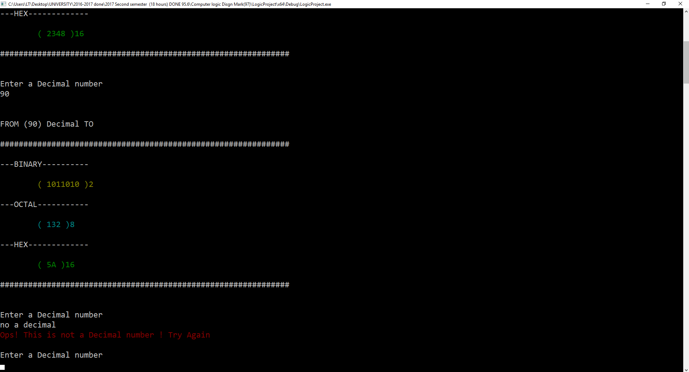
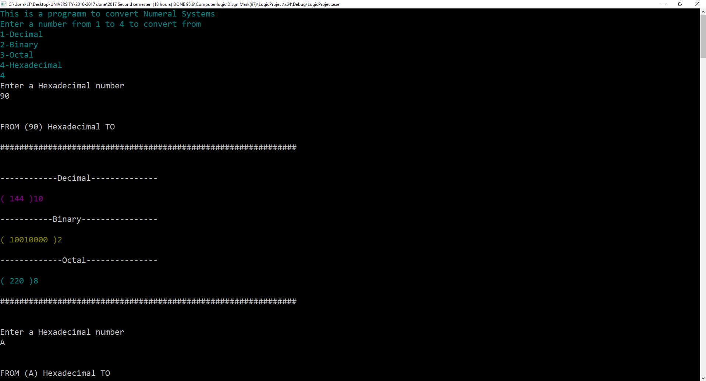
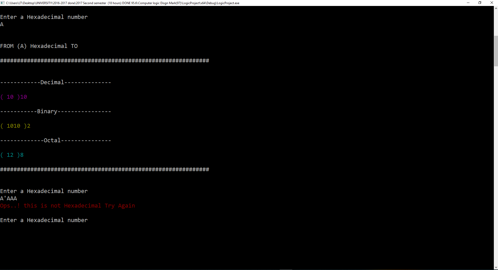

# C++ program - convert between bases


- A project I made in 2017 for a class in philadelphia university jordan called computer logic design.

# About
- The program convert each number form any base system to all other bases.
- The program validate the user input.

# Program Interface
### from decimal to other systems


### The program validate the user input

### from hex to other systems


### this work for all systems
# Code Samples
### BinaryToOther Class
``` cpp
#include <iostream>
#include "stdafx.h"
#include <windows.h> 
#include <math.h>
#include <string>
using namespace std;
class BinaryToOther {
public:
	BinaryToOther();

	double convert_to_decimal(double binary_number) {
		double fractional;
		double integer;
		fractional = modf(binary_number, &integer);
		int counter = 0;
		int integer2 = (int)integer;
		int int_array[100];
		while (integer2)
		{
			int_array[counter] = integer2 % 10;
			integer2 /= 10;
			counter++;
		}
		int result1 = 0;
		for (int i = counter - 1; i >= 0; i--)
		{
			result1 += int_array[i] * pow(2, i);
		}
		if (fractional > 0)
		{
			
			string x = to_string(fractional);
			
			int size = x.size();
			char digits[100];
			int found_it;
			int counter = 0;
			for (int i = 1; i < size; i++)
			{
				if (x[i] == '.')
				{
					found_it = i;
				}
				else
				{
					digits[i] = x[i];
					counter++;
				}
			}
			double result2 = 0;
			int k = -1;
			for (int j = 2; j < counter; j++)
			{
				result2 += ((double)digits[j] - 48) * pow(2, k);
				k--;
			}
			return result1 + result2;
		}
		return result1;
	}
};
```
### DecimalToBinary Class
``` cpp
#include <iostream>
#include "stdafx.h"
#include <windows.h> 
#include <math.h>
#include <string>
using namespace std;
#ifndef DecimalToBinary_H
#define DecimalToBinary_H
class DecimalToBinary {
	HANDLE  hConsole = GetStdHandle(STD_OUTPUT_HANDLE);
public:
	DecimalToBinary();

	int integers_array[100];
	int fractional_array[100];
	int counter = 0;
	// The Method that convert to Binary
	void convert_To_Binary(double decimal_num) {
		double fractional;// To store the fractional part from the number
		double integers;// To store the integer part from the number
		fractional = modf(decimal_num, &integers);//getting the fractional part and the integer part
		int real_intergers = (int)integers; // casting the integers to real_integers to perform mod(%) later!
		//cout << "fractional =" << fractional << " integers = " << integers << " real_intergers = " << real_intergers << endl;  //tracing
		// converting the integer part!
		while (real_intergers != 0)
		{
			if (real_intergers % 2 == 0)
			{
				integers_array[counter] = 0;
				counter++;
			}
			else
			{
				integers_array[counter] = 1;
				counter++;
			}
			real_intergers = real_intergers / 2;
		}// end of integer convert!
		int hold_counter = counter;
		counter = 0;
		SetConsoleTextAttribute(hConsole, 6);//darkyellow
		// start typing the integer part in binary
		cout << "( ";
		for (int i = hold_counter; i >= 0; i--)
		{
			cout << integers_array[i - 1];
			counter++;
			if (counter == hold_counter)break;

		}//end of typing!
		if (fractional == 0)// style!
		{
			cout << " )2\n";
		}
		if (fractional > 0)// if the number we want to convert has fractional!
		{
			double x;
			int counter2 = 0;
			while (counter2 < 5)// start converting the fractional part  (only five fractional digits)!
			{
				if (fractional * 2 > 1)
				{
					fractional_array[counter2] = 1;
					//cout  << counter2 << " " <<fractional; // tracing

				}
				else
				{
					fractional_array[counter2] = 0;
				}
				fractional *= 2;
				fractional = modf(fractional, &x);// seperate the fracional part from the integer
				counter2++;


			}// end converting the fractional part
			counter2 = 0;
			cout << ".";
			for (int i = 5; i > counter2; i--)// typing the fractional part
			{
				cout << fractional_array[i - 1];

			}
			cout << " )2\n";
			
		}
	}


	void convet_to_octal(double decimal_number) {
		int result;
		int hold[100];
		int hold2[100];
		double num_before_point;//intergers
		double numb_after_point;//fractionals
		//saperate the fractional part from the ineger part
		numb_after_point = modf(decimal_number, &num_before_point);
		int real_intergers = (int)num_before_point;
		int i = 0;
		while (real_intergers != 0)
		{
			result = real_intergers % 8;
			hold[i] = result;
			i++;
			real_intergers = real_intergers / 8;
		}
		SetConsoleTextAttribute(hConsole, 3);
		cout << "( ";
		for (int j = i; j > 0; j--)
		{
			cout << hold[j - 1];
		}
		if (numb_after_point == 0)//style!
		{
			cout << " )8 \n";
		}
		i = 0;
		if (numb_after_point > 0)
		{
			int counter = 0;
			double result2;
			double result3;
			cout << ".";
			while (counter < 5)
			{
				result2 = modf(numb_after_point * 8, &result3);
				hold2[i] = result3;

				numb_after_point = result2;
				counter++;
				i++;
				cout << result3;
			}

			cout << " )8\n";
		}
	}
	void convert_to_Hexadecimal(double decimal_number) {
		double integers, fractionals;
		fractionals = modf(decimal_number, &integers);
		int real_integers = (int)integers;
		int i = 0, result;
		int reverse[100];
		while (real_integers != 0)
		{
			result = real_integers % 16;
			real_integers /= 16;
			reverse[i] = result;
			i++;
		}
		SetConsoleTextAttribute(hConsole, 2);
		cout << "( ";
		for (int k = i; k > 0; k--)
		{
			switch (reverse[k - 1])
			{
			case 10:
				cout << "A";
				break;
			case 11:
				cout << "B";
				break;
			case 12:
				cout << "C";
				break;
			case 13:
				cout << "D";
				break;
			case 14:
				cout << "E";
				break;
			case 15:
				cout << "F";
				break;
			default:
				cout << reverse[k - 1];
				break;
			}
		}
			if (fractionals == 0)
			{
				cout << " )16 \n";
			}
			
			double result2;
			double result3;
			int counter = 0;
			int holder[100];
			if (fractionals > 0)
			{
				cout << ".";
				i = 0;
				while (counter < 5) {
					result2 = modf(fractionals * 16, &result3);
					holder[i] = result3;
					counter++;
					i++;
					fractionals = result2;
				}
				for (int s = 0; s < i; s++)
				{
					switch (holder[s])
					{
					case 10:
						cout << "A";
						break;
					case 11:
						cout << "B";
						break;
					case 12:
						cout << "C";
						break;
					case 13:
						cout << "D";
						break;
					case 14:
						cout << "E";
						break;
					case 15:
						cout << "F";
						break;
					default:
						cout << holder[s];
						break;
					}
				}
				cout << " )16 \n";
			}
			
		}

};
#endif // !DecimalToBinary_h
```
### HexadecimalToAll class
``` cpp
#include <iostream>
#include "stdafx.h"
#include <windows.h> 
#include <math.h>
#include <string>
using namespace std;
class HexadecimalToAll {
public:
	HexadecimalToAll();

	double convert_to_decimal(string Hexadecimal_string) {
		int hexadecimal_string_size = Hexadecimal_string.size();
		int found_it;
		int result1 = 0;
		int counter1 = 0;
		char tokenaizer[100];
		for (int i = 0; i < hexadecimal_string_size; i++)
		{
			tokenaizer[i] = Hexadecimal_string[i];
			counter1++;
		}
		int real_Hexadecimal_number[100];
		for (int i = 0; i < counter1; i++)
		{
			if (tokenaizer[i] == '.')
			{
				found_it = i;
				break;
			}
			switch (tokenaizer[i])
			{
			case 'A':
				real_Hexadecimal_number[i] = 10;
				break;
			case 'B':
				real_Hexadecimal_number[i] = 11;
				break;
			case 'C':
				real_Hexadecimal_number[i] = 12;
				break;
			case 'D':
				real_Hexadecimal_number[i] = 13;
				break;
			case 'E':
				real_Hexadecimal_number[i] = 14;
				break;
			case 'F':
				real_Hexadecimal_number[i] = 15;
				break;
			default:
				/*
				Numbers in ASCII Code starts from 48
				SO ....number 9 in ascii code is -> 9+48 = 57
				number 2 -> 2+48 = 50
				*/
				real_Hexadecimal_number[i] = (int)tokenaizer[i] - 48;
				break;
			}
		}
		if (found_it > 0) //EVERY THING CHANGE FROM HRERE!
		{
			double frac[100];
			int countereeer = found_it + 1;
			int counter99 = 0;
			for (int i = countereeer; i < hexadecimal_string_size; i++)
			{
				switch (tokenaizer[i])
				{
				case 'A':
					frac[i] = 10;
					break;
				case 'B':
					frac[i] = 11;
					break;
				case 'C':
					frac[i] = 12;
					break;
				case 'D':
					frac[i] = 13;
					break;
				case 'E':
					frac[i] = 14;
					break;
				case 'F':
					frac[i] = 15;
					break;
				default:
					frac[i] = (double)tokenaizer[i] - 48;
					break;
				}
				/*frac[i] = (double)FileMeasure[i] - 48 ;
				cout << "frac[" << i << "]" << frac[i] <<endl;
				//found_it++;
				counter99++;*/
			}
			int power = -1;
			double result2 = 0;

			for (int j = countereeer; j < hexadecimal_string_size; j++)
			{
				result2 += (pow(16, power) * frac[j]);

				//cout << "POW(16," << power << ") * frac[" << j << "] = ";
				//cout << (pow(16, power) * frac[j]) << endl;
				power--;

			}
			//cout << result2 << endl;
			
			int counter = found_it - 1;
			for (int i = 0; i < found_it; i++)
			{
				result1 += real_Hexadecimal_number[i] * pow(16, counter);
				counter--;
			}
			return result1 + result2;
		}
		else
		{
			int counter = hexadecimal_string_size-1;
			for (int i = 0; i < hexadecimal_string_size; i++)
			{
				result1 += real_Hexadecimal_number[i] * pow(16, counter);
				counter--;
			}
			
			return result1;
		}
	}

};
```
### OctalToAll class
``` cpp
#include <iostream>
#include "stdafx.h"
#include <windows.h> 
#include <math.h>
#include <string>
using namespace std;
class OctalToAll {
public:
	OctalToAll();


	double convert_to_decimal(double octal_number) {
		double fractional;
		double integer;
		fractional = modf(octal_number, &integer);
		int counter = 0;
		int integer2 = (int)integer;
		int int_array[100];
		while (integer2)
		{
			int_array[counter] = integer2 % 10;
			integer2 /= 10;
			counter++;
		}
		//tracing
		/*
		for (int j = 0; j < counter; j++)
		{
		cout << int_array[j] << endl;
		}
		*/
		//cout << " ( ";
		int result1 = 0;
		for (int i = counter - 1; i >= 0; i--)
		{
			result1 += int_array[i] * pow(8, i);
		}
		//cout << "The Answer is "<<result1;
		if (fractional == 0)
		{
			//cout << ") 10";
		}
		if (fractional > 0)
		{
			string x = to_string(fractional);

			int size = x.size();
			char digits[100];
			int found_it;
			int counter = 0;
			for (int i = 1; i < size; i++)
			{
				if (x[i] == '.')
				{
					found_it = i;
				}
				else
				{
					digits[i] = x[i];
					counter++;
				}

			}
			double result2 = 0;
			int k = -1;
			for (int j = 2; j < counter; j++)
			{
				result2 += ((double)digits[j] - 48) * pow(8, k);
				k--;
			}
			return result1 + result2;
		}
		return result1;
	}
	
	

};

```
### MAIN
``` cpp
//Mohammed Al-Rowad ãÍãÜÏ ÎÜáíÜá ÇáÑæÇÏ
//Number 4  logic circuit design project
//201420697
#include "stdafx.h"
#include <iostream>
#include <windows.h> 
#include <sstream>
#include "DecimalToBinary.h"
#include "BinaryToOther.h"
#include "OctalToAll.h"
#include "HexadecimalToAll.h"
#include <conio.h>

using namespace std;

int main()
{
	double x = 0;// used to convert
	string hexadecimal_string;// used to convert
	HANDLE  hConsole = GetStdHandle(STD_OUTPUT_HANDLE);//to change the color of the console
	SetConsoleTextAttribute(hConsole, 3);
	cout << "This is a programm to convert Numeral Systems" << endl;
	cout << "Enter a number from 1 to 4 to convert from" << endl;
	cout << "1-Decimal\n2-Binary\n3-Octal\n4-Hexadecimal\n";
	// choose the numeral system to convert from
	int choice;//the system the user want to convert from
	cin >> choice;
	// if the input it not an int or out of range
	while ((choice <= 0) || (choice > 4) || cin.fail())
	{
		SetConsoleTextAttribute(hConsole, 4);//red
		cout << "Please Enter a number from 1 to 4" << endl;
		cin.clear();
		cin.ignore(256, '\n');
		cin >> choice;
	}
	SetConsoleTextAttribute(hConsole, 3);// Light Aqua
	//the objects that are used to convert
	DecimalToBinary decimal_to_ALL;
	BinaryToOther   binary_to_ALL;
	OctalToAll      octal_to_ALL;
	HexadecimalToAll hexadecimal_to_ALL;
	//cout << "1-Decimal\n2-Binary\n3-Octal\n4-Hexadecimal\n";
	SetConsoleTextAttribute(hConsole, 7);// white
	//cout << choice << endl;
	int i = 0;
	while (i != 5)
	{
		DecimalToBinary decimal_to_ALL;
		BinaryToOther   binary_to_ALL;
		OctalToAll      octal_to_ALL;
		HexadecimalToAll hexadecimal_to_ALL;
		bool binary_police2 = true;
		bool octal_police2 = true;
		bool hexadecimal_police2 = true;
		switch (choice)//Convert from
		{
		case 1://From Decimal

			cout << "Enter a Decimal number\n";
			double decimal_num;
			if (cin >> decimal_num)
			{
				//system("color 0a");
				cout << "\n\nFROM (" << decimal_num << ") Decimal TO\n\n";
				cout << "##############################################################" << endl;
				cout << endl;
				cout << "---BINARY----------" << endl << endl;
				cout << "\t";
				decimal_to_ALL.convert_To_Binary(decimal_num);
				SetConsoleTextAttribute(hConsole, 7);//white
				cout << endl << "---OCTAL-----------" << endl << endl;
				cout << "\t";
				decimal_to_ALL.convet_to_octal(decimal_num);
				SetConsoleTextAttribute(hConsole, 7);//white
				cout << endl << "---HEX-------------" << endl << endl;
				cout << "\t";
				decimal_to_ALL.convert_to_Hexadecimal(decimal_num);
				SetConsoleTextAttribute(hConsole, 7);//white
				cout << "\n##############################################################\n\n" << endl;
			}
			else
			{
				cin.clear();
				cin.ignore(INT_MAX, '\n');
				SetConsoleTextAttribute(hConsole, 4);//red
				cout << "Ops! This is not a Decimal number ! Try Again \n\n";
				SetConsoleTextAttribute(hConsole, 7);
			}
			break;
		case 2://FROM Binary

			cout << "Enter a Binary number \n\n";
			double binary_number, binary_holder;
			int binary_police;
			int binary_police_counter;
			if (cin >> binary_number)
			{
				binary_holder = binary_number;
				while (binary_holder != 0)
				{
					binary_police = fmod(binary_holder, 10);
					if (binary_police > 1)
					{
						binary_police2 = false;
						binary_police_counter++;
						break;
					}
					else if (binary_police_counter == 0)
					{
						binary_police2 = true;
					}
					binary_holder /= 10;
				}
				if (binary_police2 == true)
				{
					cout << "\n\nFROM (" << binary_number << ") Binary TO \n\n";
					cout << "##############################################################\n" << endl;
					SetConsoleTextAttribute(hConsole, 7);//white
					cout << "\n---------Decimal----------" << endl << endl;
					SetConsoleTextAttribute(hConsole, 5);
					cout << "\t(" << binary_to_ALL.convert_to_decimal(binary_number) << ")10\n";
					x = binary_to_ALL.convert_to_decimal(binary_number);
					SetConsoleTextAttribute(hConsole, 7);//white
					cout << "\n----------Octal-----------" << endl << endl;
					cout << "\t";
					decimal_to_ALL.convet_to_octal(x);
					SetConsoleTextAttribute(hConsole, 7);//white
					cout << "\n----------HEX-------------" << endl << endl;
					cout << "\t";
					decimal_to_ALL.convert_to_Hexadecimal(x);
					SetConsoleTextAttribute(hConsole, 7);//white
					cout << "\n##############################################################\n\n" << endl;
				}
				else
				{
					cin.clear();
					cin.ignore(INT_MAX, '\n');
					SetConsoleTextAttribute(hConsole, 4);//red
					cout << "Ops..! this is not binry Try Again \n\n";
					SetConsoleTextAttribute(hConsole, 7);
				}

			}
			else
			{
				cin.clear();
				cin.ignore(INT_MAX, '\n');
				SetConsoleTextAttribute(hConsole, 4);//red
				cout << "Ops..! this is not binry Try Again \n\n";
				SetConsoleTextAttribute(hConsole, 7);
			}


			break;
		case 3://FROM Octal
			cout << "Enter an Octal number\n";
			double octal_number,octal_holder;
			int octal_police, octal_police_counter;
			if (cin >> octal_number)
			{
				octal_holder = octal_number;
				
				for (int i = 0; i < sizeof(octal_holder); i++)
				{
					octal_police = (int)fmod(octal_holder, 10);
					octal_holder /= 10;
					if (octal_police == 9 || octal_police == 8)
					{
						octal_police2 = false;
						octal_police_counter++;
						break;
					}
					else if(octal_police_counter == 0)
					{
						octal_police2 = true;
					}
				}
				if (octal_police2 == true)
				{
					cout << "\n\nFORM (" << octal_number << ") Octal TO \n\n";
					cout << "\n##############################################################" << endl;
					SetConsoleTextAttribute(hConsole, 7);//white
					cout << "\n------------Decimal--------------\n\n";
					SetConsoleTextAttribute(hConsole, 1);//Blue
					cout << "( " << octal_to_ALL.convert_to_decimal(octal_number) << " )10" << endl;
					x = octal_to_ALL.convert_to_decimal(octal_number);
					SetConsoleTextAttribute(hConsole, 7);//white
					cout << "\n------------Binary---------------\n\n";
					decimal_to_ALL.convert_To_Binary(x);
					SetConsoleTextAttribute(hConsole, 7);//white
					cout << "\n--------------Hex----------------\n\n";
					decimal_to_ALL.convert_to_Hexadecimal(x);
					SetConsoleTextAttribute(hConsole, 7);//white
					cout << "\n##############################################################\n\n" << endl;
				}
				else
				{
					octal_police_counter = 0;
					cin.clear();
					cin.ignore(INT_MAX, '\n');
					SetConsoleTextAttribute(hConsole, 4);//red
					cout << "Ops..! this is not An Octal Try Again \n\n";
					SetConsoleTextAttribute(hConsole, 7);
				}
				
			}
			else
			{
				cin.clear();
				cin.ignore(INT_MAX, '\n');
				SetConsoleTextAttribute(hConsole, 4);//red
				cout << "Ops..! this is not An Octal Try Again \n\n";
				SetConsoleTextAttribute(hConsole, 7);
			}
			break;

		case 4://FROM Hexadecimal
			cout << "Enter a Hexadecimal number \n";
			cin >> hexadecimal_string;
			int hexadecimal_police;
			for (int i = 0; i < hexadecimal_string.size(); i++)
			{

				if (hexadecimal_string[i] == 'A' ||
					hexadecimal_string[i] == 'B' ||
					hexadecimal_string[i] == 'C' ||
					hexadecimal_string[i] == 'D' ||
					hexadecimal_string[i] == 'E' ||
					hexadecimal_string[i] == 'F' ||
					hexadecimal_string[i] == '0' ||
					hexadecimal_string[i] == '1' ||
					hexadecimal_string[i] == '2' ||
					hexadecimal_string[i] == '3' ||
					hexadecimal_string[i] == '4' ||
					hexadecimal_string[i] == '5' ||
					hexadecimal_string[i] == '6' ||
					hexadecimal_string[i] == '7' ||
					hexadecimal_string[i] == '8' ||
					hexadecimal_string[i] == '9' ||
					hexadecimal_string[i] == '.'
					) {
					if (hexadecimal_string == ".")
					{
						hexadecimal_police2 = false;
						break;
					}
					hexadecimal_police2 = true;
				//	break;
				}
				else 
				{
					hexadecimal_police2 = false;
					break;
				}
			}
			if (hexadecimal_police2 == true)
			{
				cout << "\n\nFROM (" << hexadecimal_string << ") Hexadecimal TO\n\n";
				cout << "##############################################################\n" << endl;
				cout << "\n------------Decimal--------------\n\n";
				SetConsoleTextAttribute(hConsole, 5);
				cout << "( " << hexadecimal_to_ALL.convert_to_decimal(hexadecimal_string) << " )10\n";
				SetConsoleTextAttribute(hConsole, 7);//white
				cout << "\n-----------Binary----------------\n\n";
				x = hexadecimal_to_ALL.convert_to_decimal(hexadecimal_string);
				decimal_to_ALL.convert_To_Binary(x);
				SetConsoleTextAttribute(hConsole, 7);//white
				cout << "\n-------------Octal---------------\n\n";
				decimal_to_ALL.convet_to_octal(x);
				SetConsoleTextAttribute(hConsole, 7);//white
				cout << "\n##############################################################\n\n" << endl;
				
			}
			else
			{
				hexadecimal_police = 0;
				cin.clear();
				cin.ignore(INT_MAX, '\n');
				SetConsoleTextAttribute(hConsole, 4);//red
				cout << "Ops..! this is not Hexadecimal Try Again \n\n";
				SetConsoleTextAttribute(hConsole, 7);
			}
			break;
		default:
			// this will never be called
			SetConsoleTextAttribute(hConsole, 4);//red
			cout << "NOT A Valid Option\n";
			SetConsoleTextAttribute(hConsole, 7);//white
			break;
		}

	}

	system("pause");
}
```
